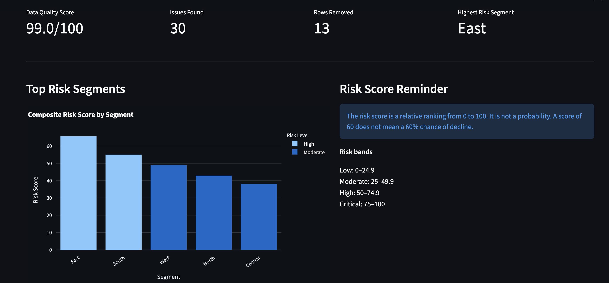
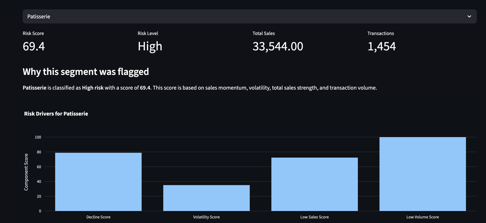
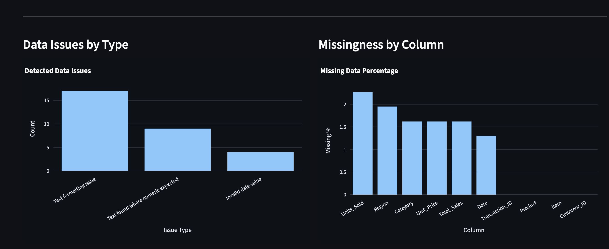

# Retail Data Quality & Predictive Analytics Dashboard

End-to-end Python analytics project that cleans messy retail sales data, validates input quality, generates explainable risk scores, and presents business-ready insights in an interactive Streamlit dashboard.

This project demonstrates the full analytics workflow required to move from unreliable source data to clean, explainable, decision-ready output.

---

## Business Case

Retail leaders often receive store or segment-level sales data from spreadsheets, exports, or operational systems. Before that data can support decisions, an analyst needs to answer several questions:

1. Can the data be trusted?
2. What changed during cleaning?
3. Which segments show the highest relative risk?
4. What factors are driving the risk score?
5. How can the results be reviewed quickly by a business stakeholder?

This project simulates that workflow using a reproducible Python pipeline.

The result is a portfolio-ready analytics application that combines data cleaning, validation, feature engineering, explainable risk scoring, Excel-style reporting, automated tests, and an interactive dashboard.

---

## Dashboard Preview

### Main Dashboard

### Segment Risk Drilldown

### Data Quality Review

---

## Sample Outputs

The repository includes curated sample outputs so reviewers can inspect the results without running the project locally.

| Output | Description |
|---|---|
| `sample_outputs/cleaned_output.csv` | Cleaned retail dataset produced by the cleaning workflow |
| `sample_outputs/cleaning_report_output.xlsx` | Excel validation report with original data, cleaned data, issue log, missingness summary, numeric summary, and text distributions |
| `sample_outputs/predictive_analytics_output.xlsx` | Predictive analytics workbook with executive summary, model insights, risk score explanation, and full model output |

---

## What This Project Demonstrates

- Cleaning and validating messy business data
- Building a configurable analytics pipeline with `config.json`
- Preserving transparency through validation checks and issue reporting
- Creating an explainable composite risk score
- Translating technical outputs into business-friendly dashboard views
- Using automated tests and GitHub Actions to verify core logic
- Designing outputs for both analysts and non-technical stakeholders

---

## Project Workflow

    Raw retail dataset
        |
        v
    Configuration layer: config.json
        |
        v
    Validation engine: validation.py
        |
        v
    Data cleaning: clean_retail_data.py
        |
        v
    Predictive analytics: predictive_analytics.py
        |
        v
    Interactive dashboard: dashboard.py
        |
        v
    Business review and decision support

---

## Repository Structure

    retail-data-quality-risk-dashboard/

    .github/
    - workflows/
      - tests.yml

    clean_retail_data.py
    predictive_analytics.py
    dashboard.py
    validation.py
    config.json
    requirements.txt
    README.md

    sample_data/
    - demo_retail_dataset.csv

    sample_outputs/
    - cleaned_output.csv
    - cleaning_report_output.xlsx
    - predictive_analytics_output.xlsx

    screenshots/
    - dashboard_overview.png
    - segment_analysis.png
    - data_quality.png

    tests/
    - test_validation.py
    - test_cleaning.py
    - performance_test.py

---

## Key Components

### 1. Configurable Inputs

The project uses `config.json` so the workflow can be adjusted without rewriting the core scripts.

The configuration layer supports:

- Input file location
- Output file names
- Date column mapping
- Sales column mapping
- Category column mapping
- Customer column mapping
- Unit column mapping

This makes the project more realistic than a one-off notebook because column names and file paths can be changed through configuration.

---

### 2. Validation Layer

The validation layer is centralized in `validation.py`.

It checks for common setup and input problems before the workflow runs, including:

- Missing config fields
- Missing required mappings
- Duplicate mappings
- Invalid input paths
- Unsupported file types
- Missing datasets

This helps prevent silent failures and makes the workflow easier to troubleshoot.

---

### 3. Data Cleaning

The cleaning workflow is handled in `clean_retail_data.py`.

It performs:

- Original dataset preservation
- Cleaned dataset generation
- Duplicate detection
- Invalid numeric removal
- Date validation
- Missingness reporting
- Numeric summaries
- Text distributions
- Issue logging
- Cell-level tracking

Generated report sections include:

- `Original_Data`
- `Cleaned_Data`
- `Change_Log`
- `Missingness`
- `Numeric_Summary`
- `Text_Distributions`

The goal is not only to clean the data, but to make the cleaning process reviewable by another analyst or stakeholder.

---

### 4. Predictive Analytics

The predictive analytics workflow is handled in `predictive_analytics.py`.

It creates a transparent composite risk score based on business and data reliability signals.

The model evaluates:

- Sales momentum
- Recency-weighted performance
- Sales volatility
- Relative sales strength
- Transaction volume
- Customer concentration
- Outlier burden
- Data reliability

Outputs include:

- Executive summary
- Model insights
- Scientific breakdown
- Risk score explanation
- Full model output

---

## Composite Risk Score

The project uses an explainable weighted scoring approach.

| Risk Area | Weight | Example Drivers |
|---|---:|---|
| Business Trend Risk | 25% | Sales momentum, recency weighting |
| Operational Risk | 20% | Sales volatility, transaction volume |
| Customer Risk | 15% | Customer concentration |
| Performance Risk | 20% | Relative sales strength |
| Data Reliability Risk | 20% | Outlier burden, data support quality |

The score is designed as a relative ranking metric. A higher score means a segment should receive more review attention compared with other segments in the dataset.

---

## Risk Interpretation

Score range:

    0 = Lowest relative concern
    100 = Highest relative concern

Risk bands:

| Score Range | Risk Band |
|---:|---|
| 0 to 24.9 | Low |
| 25 to 49.9 | Moderate |
| 50 to 74.9 | High |
| 75 to 100 | Critical |

A risk score of 60 does not mean there is a 60% probability of decline. It means the segment ranks higher in relative concern based on the project’s weighted business and data quality signals.

---

## Dashboard

The Streamlit dashboard gives users a business-friendly way to review results.

Dashboard sections include:

### Executive KPIs

- Data quality score
- Issues detected
- Rows removed
- Highest-risk segment

### Risk Review

- Segment drilldown
- Risk drivers
- Composite risk chart
- Risk explanations

### Data Quality Review

- Missingness analysis
- Issue distribution
- Data preview

### Reporting

- Cleaning report download
- Predictive output download

Launch the dashboard with:

    streamlit run dashboard.py

---

## Automated Testing

The project includes automated tests for validation and cleaning logic. Tests run locally with `pytest` and automatically through GitHub Actions on pushes and pull requests to `main`.

Current test coverage includes:

### Validation Tests

- Valid configuration
- Missing mappings
- Duplicate mappings

### Cleaning Tests

- Duplicate removal
- Invalid numeric detection

Run tests locally with:

    PYTHONPATH=. python3 -m pytest tests/

---

## Performance Benchmark

Cleaning pipeline benchmark results:

| Rows | Runtime |
|---:|---:|
| 10,000 | 4.1 sec |
| 50,000 | 20.5 sec |
| 100,000 | 42.8 sec |

Benchmarks were executed locally on macOS.

The current implementation handles 100,000 rows in under one minute.

---

## How To Run

Install dependencies:

    pip install -r requirements.txt

Run the cleaning workflow:

    python3 clean_retail_data.py

Run the predictive analytics workflow:

    python3 predictive_analytics.py

Launch the dashboard:

    streamlit run dashboard.py

Run tests:

    PYTHONPATH=. python3 -m pytest tests/

---

## Skills Demonstrated

### Analytics

- Data cleaning
- Missingness analysis
- Feature engineering
- Predictive analytics
- Explainable risk scoring
- Data quality review
- Executive reporting

### Technical

- Python
- pandas
- OpenPyXL
- Streamlit
- Plotly
- pytest
- GitHub Actions
- Configuration-driven workflows
- Validation pipelines

### Business

- Decision support
- Risk interpretation
- Stakeholder communication
- Data quality transparency
- Translating raw data into actionable review outputs

---

## Why This Project Matters

Many analytics projects fail because the final dashboard is built on data that has not been properly cleaned, validated, or explained.

This project focuses on the full analytics lifecycle:

- Validate the inputs
- Clean the data
- Document the issues
- Engineer business-relevant signals
- Score risk transparently
- Present results in a dashboard
- Support stakeholder review

That workflow is closer to real business analytics work than a standalone visualization or notebook. It shows the ability to build practical, explainable, reviewable analytics tools that can support decision-making.

---

## Disclaimer

Created for portfolio and demonstration purposes.

The demo dataset is synthetic. Risk scores are intended for decision support and relative prioritization, not as guaranteed predictions or probabilities.